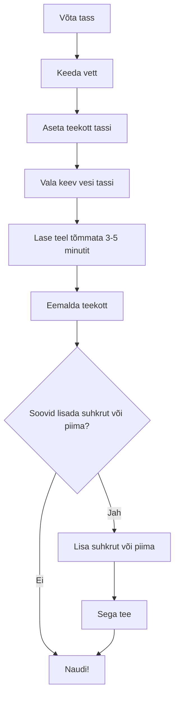

# Mis on algoritm?

Algoritm on täpne juhend või protseduur probleemi lahendamiseks või ülesande täitmiseks.

Algoritmid on samm-sammulised juhised, mis näitavad, kuidas midagi teha või kuidas mingit probleemi lahendada. Need võivad olla nii lihtsad kui retsept toidu valmistamiseks või nii keerulised kui matemaatiline valem andmete krüpteerimiseks. Programmeerimiskontekstis viitavad algoritmid tavaliselt protseduuridele või valemitele, mida arvutid kasutavad teatud ülesannete täitmiseks või probleemide lahendamiseks.

## Algoritmi kirjeldamine

Algoritme saab kirjeldada erinevates formaatides, sealhulgas loomulikus keeles, pseudokoodis, vooluskeemides ja programmeerimiskeeltes.

Põhimõtteliselt kasutame algoritme ka igapäevaelus, sageli tuuakse algoritmi kirjeldamiseks näitena välja toidu valmistamise retsept, kuna ka retseptides kirjeldatakse samm-sammult mingit tegevust.

Näiteks muna keetmise algoritm võiks välja näha selline:

1. Täida pott veega.
2. Aseta muna potti.
3. Pane pott tulele ja keeda muna umbes 10 minutit.
4. Eemalda pott tulelt ja lase munadel jahtuda.
5. Koori muna.

Või näide tee keetmisest visualiseeritult:

Selline algoritm ja vooluskeem näitavad selgelt, kuidas jõuda algusest (tühja tassi võtmine) lõpuni (tee nautimine), järgides igas sammus konkreetseid juhiseid. Vooluskeem lisab visuaalse elemendi, mis aitab protsessi paremini visualiseerida ja mõista.