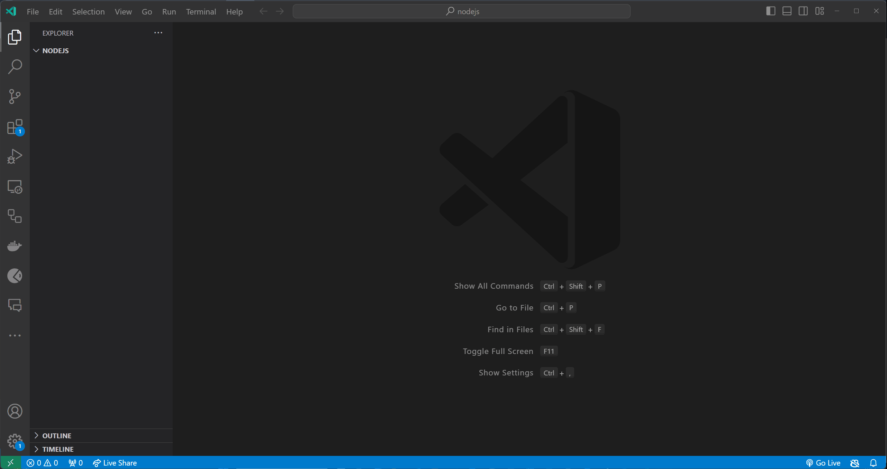

# Andmestruktuurid

Selles peatükis räägime täpsemalt andmestruktuuride kohta. Uurime, mis on andmestruktuur, mis on massiiv, mis on objekt ja kuidas massiive ning objekte kasutada.

- [Andmestruktuurid](#andmestruktuurid)
  - [Õpiväljundid](#õpiväljundid)
  - [Mis on andmestruktuur?](#mis-on-andmestruktuur)
  - [Massiiv](#massiiv)
    - [Massiivi meetodid](#massiivi-meetodid)
      - [Väärtuste lisamine massiivi](#väärtuste-lisamine-massiivi)
      - [Väärtuste otsimine massiivist](#väärtuste-otsimine-massiivist)
      - [Väärtuste eemaldamine massiivist](#väärtuste-eemaldamine-massiivist)
    - [Massiivi iteratsioon](#massiivi-iteratsioon)
  - [Objekt](#objekt)
    - [`Object.keys()` Meetod](#objectkeys-meetod)
    - [`Object.values()` Meetod](#objectvalues-meetod)
    - [`Object.entries()` Meetod](#objectentries-meetod)
  - [Harjutused](#harjutused)
    - [Harjutus 1 - Põhilised massiivi toimingud](#harjutus-1---põhilised-massiivi-toimingud)
    - [Harjutus 2 - Massiivi iteratsioon](#harjutus-2---massiivi-iteratsioon)
    - [Harjutus 3 - Põhilised objekti toimingud](#harjutus-3---põhilised-objekti-toimingud)
    - [Harjutus 4 - Objekti omaduste muutmine](#harjutus-4---objekti-omaduste-muutmine)

## Õpiväljundid

Pärast selle teema läbimist oskad:

- Määratleda, mis on andmestruktuur
- Selgitada, mis on massiiv
- Selgitada, mis on objekt
- Kasutada massiive ja objekte
- Kasutada põhilisi massiivi meetodeid

## Mis on andmestruktuur?

Me juba teame, mis on muutuja ja et seda kasutatakse andmete hoidmiseks. Kuid seni oleme suutnud salvestada muutujasse ainult ühe väärtuse või kirjeldada ainult ühte asja. Näiteks võime omada muutujat nimega `firstName`, mis salvestab inimese **eesnime**. Aga mis siis, kui soovime salvestada inimese **eesnime**, **perekonnanime**, **vanuse** ja **aadressi**? Võiksime luua igaühe jaoks eraldi muutuja, kuid see oleks väga ebaefektiivne. Selle asemel saame kasutada andmestruktuuri, et salvestada kõik need väärtused ühe muutuja sisse.

Andmestruktuur on viis andmete korraldamiseks arvuti mälus. Andmestruktuure kasutatakse andmekogumite salvestamiseks.

Javascript võimaldab kasutada järgmiseid andmestruktuure:

- Massiivid (Arrays)
- Objektid (Objects)
- Mapid (Maps)
- Setid (Sets)

> Selle teema raames keskendume massiividele ja objektidele.

## Massiiv

Massiiv on väärtuste kogum, mis on salvestatud ühte muutujasse. Tavaliselt kasutatakse massiive omavahel seotud andmekogumite salvestamiseks. Näiteks saame kasutada massiivi numbrite või nimede loendi salvestamiseks.

Massiivi loomiseks kasutame `[]` operaatorit. Näiteks saame luua massiivi nimega `numbers`, mis sisaldab numbreid `1`, `2` ja `3` nii:

```javascript
const numbers = [1, 2, 3];
```

Või saame luua massiivi nimega `names`, mis sisaldab nimesid `John`, `Jane` ja `Jack` nii:

```javascript
const names = ['John', 'Jane', 'Jack'];
```

Massiivis olevatele väärtustele pääseme ligi kasutades väärtuse indeksit. Massiivi esimese väärtuse indeks on `0`. Näiteks, kui soovime pääseda ligi `numbers` massiivi esimesele väärtusele, saame kasutada indeksit `0` nii:

```javascript
const numbers = [1, 2, 3];

console.log(numbers[0]);
```

**Oodatav väljund**:

```bash
1
```

Samuti saame väärtuse indeksit kasutades muuta massiivis olevat väärtust. Näiteks, kui soovime muuta `numbers` massiivi esimese väärtuse `10` peale, saame kasutada indeksit `0` nii:

```javascript
const numbers = [1, 2, 3];

numbers[0] = 10;

console.log(numbers);
```

**Oodatav väljund**:

```bash
[10, 2, 3]
```

### Massiivi meetodid

Meetodid on funktsioonid, mis on seotud objektiga. See tähendab, et Javascriptis saame objektiga midagi teha, kutsudes välja sisseehitatud funktsiooni, mis on seotud selle objektiga (Javascriptis on ka massiivid põhimõtteliselt objektid). Ja kuna meetod on oma olemuselt tavaline funktsioon, siis kehtivad nendele samad reeglid, mis kehtivad tavalistele funktsioonidele (näiteks saame neid kutsuda välja, saame neile argumente edastada ja ka meetodid tagastavad alati midagi).

Massiividel on hulk meetodeid, mida saame kasutada massiivide manipuleerimiseks. Näiteks saame kasutada `push()` meetodit, et lisada väärtus massiivi lõppu, `pop()` meetodit, et eemaldada väärtus massiivi lõpust, `shift()` meetodit, et eemaldada väärtus massiivi algusest ja `unshift()` meetodit, et lisada väärtus massiivi algusesse.

Kõik massiivi meetodid on loetletud [Massiivi meetodid](https://developer.mozilla.org/en-US/docs/Web/JavaScript/Reference/Global_Objects/Array) jaotises MDN veebidokumentatsioonis.

#### Väärtuste lisamine massiivi

Väärtuse lisamiseks massiivi lõppu saame kasutada `push()` meetodit. Kui soovime lisada numbri `4` `numbers` massiivi lõppu, saame kasutada `push()` meetodit nii:

```javascript
const numbers = [1, 2, 3];

numbers.push(4);

console.log(numbers);
```

**Oodatav väljund**:

```bash
[1, 2, 3, 4]
```

> Pane tähele, et massiivide meetodite kasutamine käib kujul `massiiv.meetod()`.
>
> `push()` meetod tagastab massiivi uue pikkuse.

#### Väärtuste otsimine massiivist

Väärtuse indeksi (põhimõtteliselt järjekorranumber, mis algab `0`-st) leidmiseks massiivis saame kasutada `indexOf()` meetodit. Kui soovime leida numbri `2` indeksi `numbers` massiivis, saame kasutada `indexOf()` meetodit nii:

```javascript
const numbers = [1, 2, 3];

console.log(numbers.indexOf(2));
```

**Oodatav väljund**:

```bash
1
```

> `indexOf()` meetod tagastab väärtuse indeksi massiivis.
>
> Kui massiivis on mitu sama väärtust, tagastab `indexOf()` meetod esimese väärtuse indeksi.
>
> Kui väärtust massiivis ei leita, tagastab `indexOf()` meetod `-1`.

#### Väärtuste eemaldamine massiivist

Väärtuse eemaldamiseks massiivist saame kasutada `splice()` meetodit. Kui soovime eemaldada numbri `2` `numbers` massiivist, saame kasutada `splice()` meetodit nii:

```javascript
const numbers = [1, 2, 3];

numbers.splice(1, 1);

console.log(numbers);
```

**Oodatav väljund**:

```bash
[1, 3]
```

> `splice()` meetodi esimene argument on väärtuse indeks, mida soovime eemaldada, ja teine argument on eemaldatavate väärtuste arv.
>
> `splice()` meetod tagastab eemaldatud väärtuste massiivi.
>
> Kui me ei määra teist argumenti, eemaldab `splice()` meetod kõik väärtused alates esimeses argumendis määratud indeksist.
>
> Kui määrame teise argumendi väärtuseks `0`, siis `splice()` meetod ei eemalda ühtegi väärtust.
>
> Pea meeles, et väärtuse eemaldamiseks massiivist kasutades seda meetodit, peame teadma eemaldatava väärtuse indeksit.

### Massiivi iteratsioon

Massiivi üle iteratsiooni tegemiseks saame kasutada `for` tsüklit. Kui soovime väljastada iga väärtuse `numbers` massiivist uuele reale, saame kasutada `for` tsüklit nii:

```javascript
const days = ['Esmaspäev', 'Teisipäev', 'Kolmapäev', 'Neljapäev', 'Reede', 'Laupäev', 'Pühapäev'];

for (let i = 0; i < days.length; i++) {
  console.log(days[i]);
}
```

**Oodatav väljund**:

```bash
Esmaspäev
Teisipäev
Kolmapäev
Neljapäev
Reede
Laupäev
Pühapäev
```

> Pööra tähelepanu `for` tsükli tingimusele. Peame kasutama massiivi `length` omadust tsükli tingimuses, et veenduda, et me ei lähe massiivi piiridest välja.
>
> Massiivi `length` omadus tagastab massiivis olevate väärtuste arvu.
>
> Massiivi `length` omadus on alati üks rohkem kui massiivi viimase väärtuse indeks (kuna elementide indeksite loendamine algab `0`-st).
>
> Samuti pea meeles, et `i` on väärtus, mis suureneb iga `for` tsükli iteratsiooni korral. Väärtuse `i` abil saame pääseda ligi massiivi väärtustele.
>
> Massiivi esimese väärtuse indeks on `0`, seega massiivi viimase väärtuse indeks on `length - 1`.

## Objekt

Objekt on **võti**-**väärtus** paaride kogum, mis on salvestatud ühte muutujasse. Objekte kasutatakse juhul, kui on vaja talletada informatsiooni, mis koosneb paljudest omadustest. Näiteks saame kasutada objekti inimese kohta käiva info salvestamiseks (*eesnimi*, *perekonnanimi*, *vanus*, *aadress* jne).

Objekti loomiseks kasutame `{}` operaatorit. Näiteks saame luua objekti nimega `person`, mis sisaldab omadusi:

- eesnimi: `John`,
- perekonnanimi: `Doe`,
- vanus: `25` nii:

```javascript
const person = {
  firstName: 'John',
  lastName: 'Doe',
  age: 25
};
```

Objektis olevatele väärtustele pääseme ligi kasutades väärtuse võtit. Kui soovime lugeda `person` objekti eesnime, saame kasutada võtit `firstName` nii:

```javascript
const person = {
  firstName: 'John',
  lastName: 'Doe',
  age: 25
};

console.log(person.firstName); // John
```

Samuti saame võtit kasutades muuta objektis olevat väärtust. Näiteks, kui soovime muuta `person` objekti eesnime `Jane`-ks, saame kasutada võtit `firstName` nii:

```javascript
const person = {
  firstName: 'John',
  lastName: 'Doe',
  age: 25
};

person.firstName = 'Jane';

console.log(person); // { firstName: 'Jane', lastName: 'Doe', age: 25 }
```

Nagu massiivide puhul, on ka objektide manipuleerimiseks palju meetodeid. Näiteks saame kasutada `Object.keys()` meetodit, et saada objekti võtmete massiiv, `Object.values()` meetodit, et saada objekti väärtuste massiiv, ja `Object.entries()` meetodit, et saada objekti võtme-väärtuse paaride massiiv.

### `Object.keys()` Meetod

`Object.keys()` meetod tagastab objekti võtmed massiivina. Näiteks, kui soovime saada `person` objekti võtmed massiivina, saame kasutada `Object.keys()` meetodit nii:

```javascript
const person = {
  firstName: 'John',
  lastName: 'Doe',
  age: 25
};

console.log(Object.keys(person)); // [ 'firstName', 'lastName', 'age' ]
```

Seda võib kasutada ka objekti omaduste iteratsiooniks. Näiteks, kui soovime väljastada iga võtme `person` objektis, saame kasutada `Object.keys()` meetodit nii:

```javascript
const person = {
  firstName: 'John',
  lastName: 'Doe',
  age: 25
};

for (let key of Object.keys(person)) {
  console.log(key);
}

// Väljund:
// firstName
// lastName
// age

```

Kui me ei soovi kasutada `for...of` tsüklit, saame kasutada ka `for` tsüklit nii:

```javascript

const person = {
  firstName: 'John',
  lastName: 'Doe',
  age: 25
};

for (let i = 0; i < Object.keys(person).length; i++) {
  console.log(Object.keys(person)[i]);
}

// Väljund:
// firstName
// lastName
// age

```

### `Object.values()` Meetod

`Object.values()` meetod tagastab objekti väärtused massiivina. Näiteks, kui soovime saada `person` objekti väärtused massiivina, saame kasutada `Object.values()` meetodit nii:

```javascript
const person = {
  firstName: 'John',
  lastName: 'Doe',
  age: 25
};

console.log(Object.values(person)); // [ 'John', 'Doe', 25 ]
```

### `Object.entries()` Meetod

`Object.entries()` meetod tagastab objekti võtme-väärtuse paaride massiivina. Näiteks, kui soovime saada `person` objekti võtme-väärtuse paarid massiivina, saame kasutada `Object.entries()` meetodit nii:

```javascript
const person = {
  firstName: 'John',
  lastName: 'Doe',
  age: 25
};

console.log(Object.entries(person)); // [ [ 'firstName', 'John' ], [ 'lastName', 'Doe' ], [ 'age', 25 ] ]
```

Kui me soovime nüüd näiteks väljastada ühekaupa võtme-väärtuse paare, saame kasutada `for` tsüklit nii:

```javascript
const person = {
  firstName: 'John',
  lastName: 'Doe',
  age: 25
};

for (let i = 0; i < Object.entries(person).length; i++) {
  console.log(Object.entries(person)[i]);
}

// Väljund:
// [ 'firstName', 'John' ]
// [ 'lastName', 'Doe' ]
// [ 'age', 25 ]
```

Kõik objekti meetodid on loetletud [Objekti meetodid](https://developer.mozilla.org/en-US/docs/Web/JavaScript/Reference/Global_Objects/Object) jaotises Mozilla Developer Network (MDN) veebidokumentatsioonis.

## Harjutused

Loo fail nimega `index.js` (või mõni muu sinu valikul olev nimi) ja alusta allpool toodud harjutuste lahenduste lisamist.

> Testi alati oma koodi, käivitades `index.js` faili käsu `node index.js` abil.

### Harjutus 1 - Põhilised massiivi toimingud

**Eesmärk**: Elementide massiivi lisamine ja nende väljastamine elemendi kaupa.

**Kirjeldus**: Loo massiiv, et salvestada kolme lemmikpuuvilja nimekirja. Lisa massiivi veel kaks puuvilja, kasutades massiivi **meetodeid**. Lõpuks väljasta iga puuvili massiivis eraldi reale.

> Elementide lisamiseks massiivi saad kasutada `push()` meetodit.
>
> Kasuta `for` tsüklit, et trükkida iga element massiivis uuele reale.

<details>
  <summary>Lahendus</summary>

```javascript
const fruits = ['õun', 'banaan', 'apelsin'];

fruits.push('maasikas');
fruits.push('ananass');

for (let i = 0; i < fruits.length; i++) {
  console.log(fruits[i]);
}
```


</details>

### Harjutus 2 - Massiivi iteratsioon

**Eesmärk**: Leia kõikide massiivis olevate numbrite summa.

**Kirjeldus**: Kirjuta JavaScript programm, mis loob numbrite massiivi. Itereeri üle massiivi ja arvuta selle elementide summa. Väljasta lõplik summa.

> Tõenäoliselt on vaja kasutada lisamuutujat, et salvestada kõikide numbrite summa.

<details>
  <summary>Lahendus</summary>

```javascript
const numbers = [1, 2, 3, 4, 5];

let sum = 0;

for (let i = 0; i < numbers.length; i++) {
  sum += numbers[i];
}

console.log(sum);
```

**Oodatav väljund**:

```bash
15
```

</details>

Kui soovid lahendada lisaülesandeid, siis leiad mõned siit: [Lisaülesanded massiividele](Exercises-Arrays.md).

### Harjutus 3 - Põhilised objekti toimingud

**Eesmärk**: Objekti loomine ja selle omaduste väljastamine.

**Kirjeldus**: Defineeri JavaScript objekt nimega `car` omadustega `mark`, `model` ja `year`. Määra igale omadusele sobivad väärtused. Seejärel moodust ja väljasta lause, mis sisaldab auto mudelit, marki ja aastat.

> Objekti omadustele pääsed ligi kasutades `.` operaatorit.
>
> Stringide ühendamiseks saad kasutada `+` operaatorit või kasutada mallistringi.

<details>
  <summary>Lahendus</summary>

```javascript
const car = {
  mark: 'Toyota',
  model: 'Corolla',
  year: 2019
};

console.log(`Ma sõidan ${car.year} aasta ${car.mark} ${car.model}iga.`);
```

**Oodatav väljund**:

```bash
Ma sõidan 2019 aasta Toyota Corollaga.
```



</details>

### Harjutus 4 - Objekti omaduste muutmine

**Eesmärk**: Uuenda ja lisa objektile uusi omadusi.

**Kirjeldus**: Antud on objekt `student` omadustega `name`, `age` ja `class`. Uuenda `age` omadust, lisa uus omadus `subject` ja seejärel väljasta kogu objekt.

Näide `student` objektist:

```javascript
const student = {
  name: 'John Doe',
  age: 16,
  class: 10
};
```

> Objekti omadusi saad uuendada kasutades `.` operaatorit.
>
> Uute omaduste lisamiseks objektile saad kasutada `.` operaatorit.
>
> Kasuta `console.log()` funktsiooni, et väljastada kogu objekt.

<details>
  <summary>Lahendus</summary>

```javascript
const student = {
  name: 'John Doe',
  age: 16,
  class: 10
};

student.age = 17;

student.subject = 'Matemaatika';

console.log(student);
```

**Oodatav väljund**:

```js
{ name: 'John Doe', age: 17, class: 10, subject: 'Matemaatika' }
```

</details>

Kui soovid lahendada lisaülesandeid objektide kohta, siis leiad mõned siit: [Lisaülesanded objektide kohta](Exercises-Objects.md).
