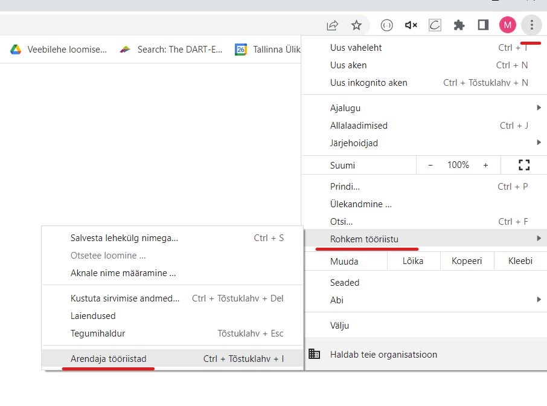
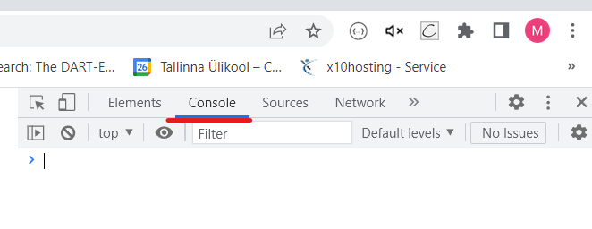
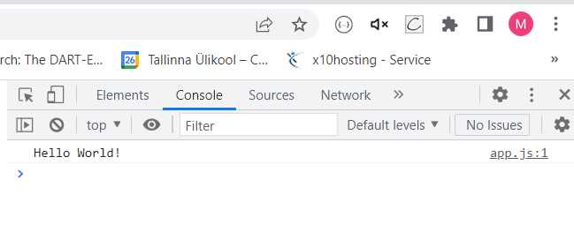

# console.log();

JavaScripti `console.log()` funktsioon on brauseri konsoolis või Node.js keskkonnas väljundi kuvamise tööriist. See on eriti kasulik silumisel ja testimisel, kuna see võimaldab teil kuvada muutujate väärtusi, veateateid, objektide omadusi, massiive ja palju muud.

`console.log()` funktsiooni kasutamine on väga lihtne. Lihtsalt kirjutage `console.log()` ja lisage sulgude vahele teave, mida soovite kuvada. See võib olla string, number, boolean, massiiv, objekt või isegi funktsioon.

Näiteks:

```html
<!DOCTYPE html>
<html lang="en">
<head>
  <meta charset="UTF-8">
  <meta http-equiv="X-UA-Compatible" content="IE=edge">
  <meta name="viewport" content="width=device-width, initial-scale=1.0">
  <title>Document</title>
</head>
<body>
  <script>
    // console.log() näide
    console.log("Hello World!");
  </script>
</body>
</html>
```

Kui avate veebilehitseja konsooli (vajutades F12 ja valides `Console` Chrome'i või Firefox'i arendusriistades) või kui kasutate Node.js keskkonda, kuvatakse seal `console.log()` funktsiooniga väljastatud teave.

Google Chrome veebilehitsejas näeb see välja nii:






> Pidage meeles, et kuigi `console.log()` on väga kasulik arendamise ja silumise ajal, ei tohiks see olla osa teie lõplikust koodist, mida kasutajad näevad. See on mõeldud ainult arendajate kasutamiseks ja selle abil võite paljastada tundlikku teavet, mida te ei soovi avaldada.

[Allikas](https://developer.mozilla.org/en-US/docs/Web/API/console/log)