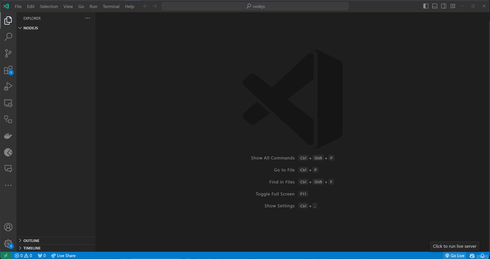

# Funktsioonid

Selles teemas vaatame, kuidas Javascriptis funktsioone defineerida ja kasutada.

- [Funktsioonid](#funktsioonid)
  - [Õpiväljundid](#õpiväljundid)
  - [Mis on Funktsioon?](#mis-on-funktsioon)
  - [Funktsioonide Deklareerimine](#funktsioonide-deklareerimine)
    - [Funktsiooni Deklaratsioon](#funktsiooni-deklaratsioon)
    - [Funktsiooni Avaldis](#funktsiooni-avaldis)
    - [Funktsiooni Kutsumine (käivitamine)](#funktsiooni-kutsumine-käivitamine)
  - [Noolfunktsioonid](#noolfunktsioonid)
  - [Harjutused](#harjutused)
    - [Harjutus 1 - Lihtne Funktsiooni Deklareerimine ja Kutsumine](#harjutus-1---lihtne-funktsiooni-deklareerimine-ja-kutsumine)
    - [Harjutus 2 - Funktsioon Tagastusväärtusega](#harjutus-2---funktsioon-tagastusväärtusega)
  - [Lisaülesanded](#lisaülesanded)

## Õpiväljundid

Pärast selle teema läbimist suudate:

- Määratleda, mis on funktsioon
- Selgitada erinevust funktsiooni deklaratsiooni ja funktsiooni avaldise vahel
- Selgitada, mis on funktsiooni kutsumine
- Selgitada, mis on funktsiooni ulatus
- Selgitada, mis on funktsiooni üles tõstmine
- Selgitada, mis on noolfunktsioonid

## Mis on Funktsioon?

Funktsioon on korduvkasutatav koodiplokk, mis täidab konkreetset ülesannet. Funktsioone kasutatakse koodi korraldamiseks loogilistesse üksustesse, mida saab programmi teistes osades uuesti kasutada.

Funktsioon koosneb (võib koosneda) järgmistest osadest:

- märksõna funktsiooni deklareerimiseks
- funktsiooni nimi
- funktsiooni parameetrid (valikuline)
- funktsiooni sisu
- tagastusavaldus (valikuline)
- tagastusväärtus (valikuline)

```javascript
function add(a, b) {
  const sum = a + b;
  return sum;
}
```

Eelnevas näites on deklareeritud funktsioon nimega `add` märksõnaga `function`, mis võtab kaks **parameetrit** `a` ja `b` ning **tagastab** `a` ja `b` summa. Funktsiooni **sisu** koosneb kahest avaldisest: `const sum = a + b;` ja `return sum;`. Esimene avaldis deklareerib muutuja nimega `sum` ja omistab sellele `a + b` väärtuse. Teine avaldis tagastab `sum` muutuja väärtuse funktsiooni väljakutsujale. Oluline on teada seda, et Javascriptis tagastab funktsioon alati `undefined`, kui tagastusavaldust ei ole deklareeritud.

> Me peame meeles pidama, et parameetrid on muutujad, mida kasutatakse väärtuste salvestamiseks, mis antakse funktsioonile, kui see käivitatakse (välja kutsutakse). Kui me ei pea funktsioonile väärtusi edastama, võime parameetrid ära jätta. Näiteks, kui me soovime deklareerida funktsiooni nimega `sayHello`, mis väljastab konsooli sõnad "Hello World!" (ehk, et funktsioonis ei tehta midagi, mis eeldaks mingeid andmeid väljastpoolt), võime selle deklareerida nii:

```javascript
function sayHello() {
  console.log('Hello World!');
}
```

## Funktsioonide Deklareerimine

Javascriptis saame funktsioone deklareerida kahel viisil:

- funktsiooni deklaratsioon;
- funktsiooni avaldis.

### Funktsiooni Deklaratsioon

Funktsiooni deklaratsiooni jaoks kasutame `function` märksõna, millele järgneb funktsiooni **nimi**, valikulised **parameetrid** ja funktsiooni **sisu**. Sarnaselt eelnevatele näidetele deklareerime funktsioone nii:

```javascript
function functionName(parameter1, parameter2) {
  // funktsiooni sisu
  return value;
}
```

### Funktsiooni Avaldis

Funktsioone saab deklareerida ka kasutades funktsiooni avaldist. Funktsiooni avaldise jaoks kasutame `const` märksõna, millele järgneb funktsiooni **nimi**, seejärel omistamisoperaator `=` ja `function`märksõna, millele omakorda järgnevad valikulised **parameetrid** ja funktsiooni **sisu**. See tähendab, et me deklareerime funktsiooni ja omistame selle muutujale. Näiteks:

```javascript
const add = function(a, b) {
  const sum = a + b;
  return sum;
}
```

Kuigi me kasutame `const` märksõna funktsiooni deklareerimiseks, saame ikkagi kutsuda funktsiooni kasutades funktsiooni **nime**, millele järgnevad **sulud `()`**. Näiteks:

```javascript
const sum = add(1, 2);

console.log(sum); // 3
```

### Funktsiooni Kutsumine (käivitamine)

Funktsiooni täitmiseks peame selle **kutsuma**. Funktsiooni saab kutsuda kasutades funktsiooni **nime**, millele järgnevad **sulud `()`**. Näiteks, kui me soovime kutsuda `add` funktsiooni, saame kirjutada koodi `add(1, 2);`. Sellega käivitame `add` funktsiooni argumentidega `1` ja `2`. Funktsioon tagastab `1` ja `2` summa, mille saame salvestada tagastusväärtuse muutujasse nii:

```javascript
const sum = add(1, 2);

console.log(sum); // 3
```

Kui me ei salvesta tagastusväärtust muutujasse, siis tagastusväärtus kaob. Näiteks, kui me kutsume `add` funktsiooni nii:

```javascript
add(1, 2);
```

Siis tagastusväärtus `3` kaob, sest me ei salvesta seda.

## Noolfunktsioonid

Noolfunktsioonid on Javascripti uuem viis funktsioonide deklareerimiseks. Need on sarnased funktsiooni avaldistega, kuid neil on lühem süntaks. Näiteks, kui me soovime deklareerida funktsiooni nimega `add`, mis võtab kaks parameetrit `a` ja `b` ning tagastab `a` ja `b` summa, saame deklareerida selle nii:

```javascript
const add = (a, b) => {
  const sum = a + b;
  return sum;
}

const result = add(1, 2);
console.log(result); // 3
```

Nagu näha, siis näeb noolfunktsiooni süntaks välja pisut teisiti, kuid selle kasutamine on sama, mis funktsiooni deklaratsiooni ja funktsiooni avaldise puhul. Noolfunktsioonid on lühemad ja neid on lihtsam lugeda.

## Harjutused

Loo fail nimega `index.js` (või teise valitud nimega) ja alusta allpool olevate harjutuste lahendamist.

Testi oma koodi, käivitades `index.js` faili node `index.js` käsu abil.

Testi oma koodi erinevate väärtustega

### Harjutus 1 - Lihtne Funktsiooni Deklareerimine ja Kutsumine

**Eesmärk**: Kirjuta funktsioon, mis väljastab tervitussõnumi.

**Kirjeldus**: Defineeri funktsioon nimega `greet`, mis võtab **argumendiks** `nime` ja väljastab "Tere, [nimi]!". Kontrolli, et funktsioon töötab, kutsudes seda vähemalt kaks korda erinevate nimedega.

<details>
  <summary>Lahendus</summary>

```javascript
function greet(name) {
  console.log(`Tere, ${name}!`);
}

greet('John');
```



</details>

### Harjutus 2 - Funktsioon Tagastusväärtusega

**Eesmärk**: Loo funktsioon, mis arvutab ja tagastab ristküliku pindala.

**Kirjeldus**: Kirjuta funktsioon nimega `calculateArea`, mis võtab argumendiks ristküliku `kõrguse` ja `laiuse` ning tagastab selle `pindala`. Kutsu seda funktsiooni erinevate väärtuste paaridega ja väljasta tulemused.

> Vihje: Funktsioonile saab anda mitu argumenti, eraldades need komadega.

<details>
  <summary>Lahendus</summary>
  
```js
function calculateArea(length, width) {
  const area = length * width;
  return area;
}

const area1 = calculateArea(5, 10);
console.log(area1);

const area2 = calculateArea(2, 4);
console.log(area2);
```

</details>

## Lisaülesanded

Kui soovid lahendada lisaülesandeid funktsioonide kohta, siis leiad mõned [siit](./Exercises.md).
