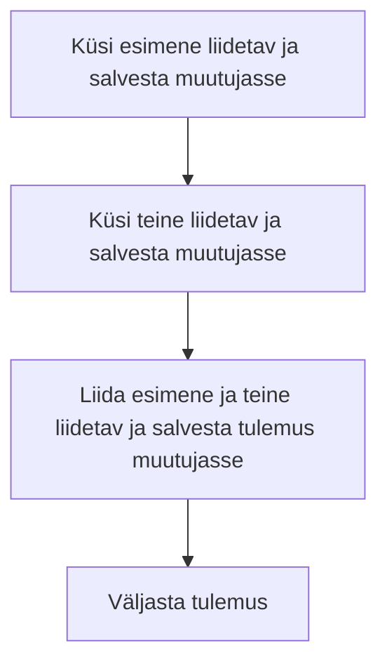

# Kodutöö

## Loe läbi loengus puudutatud teemade materjalid

- [Mis on programmeerimine?](../../concepts/programmeerimine/README.md)
- [Mis on algoritm?](../../concepts/algoritm/README.md)
- [Mis on Javascript?](../../concepts/javascript/README.md)
- [Kuidas alustada Javascripti koodi kirjutamist?](../../concepts/alustamine/README.md)
- [Programmi sisend ja väljund](../../concepts/suhtlemine/README.md)
- [Muutuja](../../concepts/muutuja/README.md)
- [Andmetüübid](../../concepts/andmetyybid/README.md)
- [Operaatorid](../../concepts/operaatorid/README.md)

## Loe läbi ka järgmised teemad

- [Tingimuslause](../../concepts/tingimuslause/README.md)
- [Tüübiteisendus](../../concepts/tyybiteisendus/README.md)

## Harjutus

Proovi teha kalkulaator, mis suudab teha liitmistehteid. Kalkulaator peaks küsima kasutajalt esimese liidetava, seejärel teise liidetava, arvutama need kokku ja väljastama tulemuse kasutajale.

### Harjutuse algoritm

