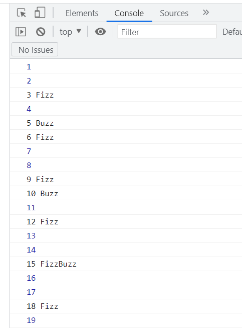

# Kodutöö variant 1

Koosta programm, mis loendab arvud 1 - 100. Iga arv väljastatakse ekraanile, seejuures järgmiste tingimustega:

- Kui arv jagub kolmega, väljastatakse arvu järele sõna "Fizz"
- Kui arv jagub viiega, väljastatakse arvu järele sõna "Buzz"
- Kui arv jagub nii kolmega kui viiega, väljastatakse arvu järele sõna "FizzBuzz"
- Kui ükski eelnevatest tingimustest ei ole täidetud, väljastatakse lihtsalt arv.

**Tulemuse näide:**

# Kodutöö variant 2

Mäng 'Kivi - Paber - Käärid'

## Kõige lihtsam variant:

- Kaks mängijat
- Küsitakse valikut ühe mängija käest
- Küsitakse valikut teise mängija käest
- Kuvatakse tulemus
- Lõpp

## Natukene keerulisem variant

- Kõigepealt küsitakse mitme punktini mängitakse
- Muu on sama, mis eelmises variandis, kuid nüüd loendatakse võitude eest punkte (viigi eest punkte ei anta)
- Punktiseisu kuvatakse peale igat 'käiku'
- Mäng saab läbi kui üks mängija jõuab määratud punktideni

Mõtle kõigepealt läbi sammud, mida on teha vaja.

Alusta kõige lihtsamast variandist.

Kui jääd hätta, siis küsi abi.

Ülesannete lahendused saada martti.raavel@tlu.ee